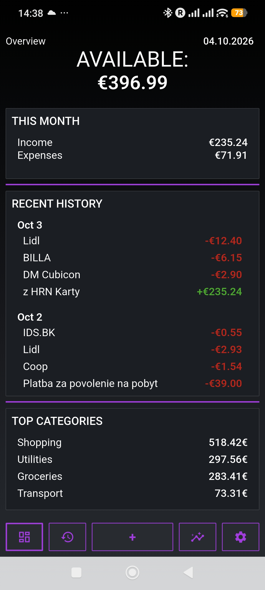
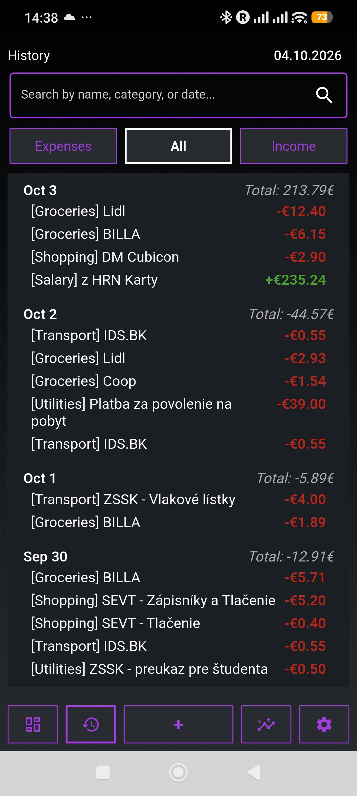
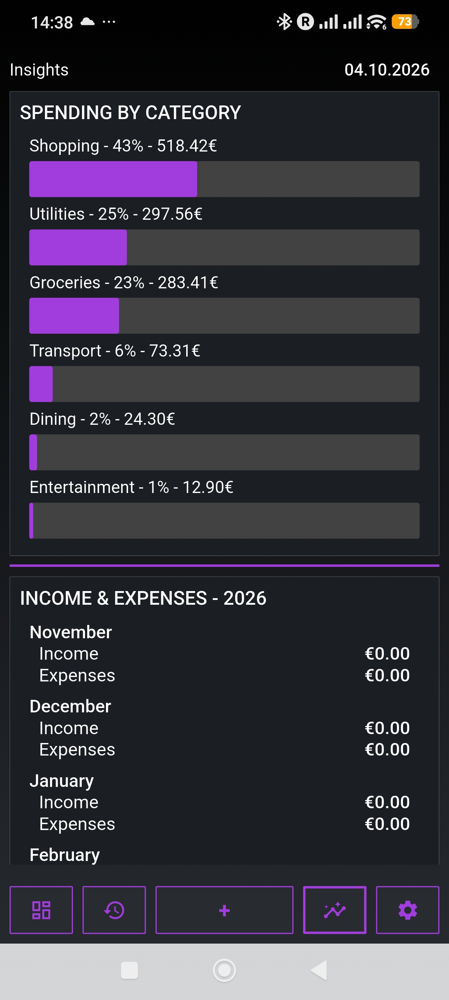

# Holo Budgeter

A simple offline budget and expense tracking app built with Flutter.

No account, ads, tracking, or cloud sync. Transactions are stored locally on the device.

  
  
  

## Downloads

- [Android - v1.0](https://github.com/sunflowerweather/holo-budgeter/releases/tag/v1.0-android)
- [Windows - v1.0](https://github.com/sunflowerweather/holo-budgeter/releases/tag/v1.0-windows)

## Features

### Offline

Holo Budgeter works entirely offline. Transactions are stored locally and the app does not require an internet connection.

### Overview

The Overview screen is the main screen opened when the app starts.

It shows:

* Available amount of money
* This month's transaction history
* This month's total expenses and income
* Top 4 expense categories

### History

The History screen displays all transactions.

Each date shows the total amount of money involved in transactions on that day. For example, transactions of -€4, +€15, and -€1 would result in a daily total of €10.00.

Transactions can be filtered by:

* Expenses
* Income
* All transactions

Transactions can also be searched by name, expense category, or date.

The date search supports common date formats such as `Sep 3`, `21.04.26`, `October`, and similar formats.

Long-press the transaction to remove it, after confirming the action.

### Insights

The Insights screen provides graphs and statistics about your finances.

#### Spending by Category

This graph shows spending across all seven expense categories:

* Shopping
* Utilities
* Groceries
* Transport
* Dining
* Entertainment
* Other

Each used category is displayed with a progress bar showing its percentage of total spending.

Categories are ordered from the most used to the least used. Each progress bar shows the category name, its percentage, and the amount of money spent on it.

The percentages of all displayed categories add up to 100%.

The `Income` category is an internal category and cannot be selected manually.

#### Income & Expenses - Year

This graph shows the total income and expenses for each month of the current year.

It works similarly to the monthly statistics on the Overview screen, but displays the entire year instead of only the current month.

#### Income vs Expenses

This column graph compares income and expenses over the last 7 months, including the current month.

Each month has two columns:

* Income
* Expenses

The vertical axis represents the amount of money. Its scale adjusts dynamically based on the largest value shown.

#### Balance

The Balance graph shows changes in available money over the last 7 months.

The graph uses a stock-like line design. When the balance goes up, that section of the line represents money being added. When it goes down, that section represents money being spent.

### New Transaction

The New Transaction screen allows you to add a new transaction.

You can choose:

* Transaction name
* Category
* Amount of money
* Date
* Transaction type

Transactions can be marked as either an expense or income.

The type toggle becomes red when Expense is selected and green when Income is selected.

A category can only be selected for expenses. Income transactions automatically use the internal `Income` category.

### Navigation

The app uses five buttons at the bottom of each screen for easy navigation:

* Overview
* History
* New Transaction
* Insights
* Settings

The New Transaction button is the largest button and uses a `+` icon.

### Themes

The app includes multiple light and dark themes. Themes can be changed from the Settings screen.

The default Holo Budgeter theme uses purple as its main accent color.

### Currency

The app supports several common currency symbols.

The default currency is euro (`€`), with other available options including:

* Dollar (`$`)
* Pound sterling (`£`)
* Hryvnia (`₴`)
* Yen (`¥`)
* Swiss franc (`Fr`)
* Złoty (`zł`)
* Czech koruna (`Kč`)
* Krone (`kr`)
* Rupee (`₹`)

### Backup and Restore

Transactions can be exported to a JSON file and imported later.

This can be used for backups or moving your data to another device.

### Settings

The Settings screen uses the same floating-window design as Holo Notes.

It includes:

* Theme selection
* Backup
* Restore
* Currency selection

## Getting Started

Install the app and start adding transactions. No account or setup is required.

Transactions are saved automatically.

## Backup

To back up your transactions, export them from the app as a JSON file.

The same file can be imported later to restore your data.

## Technologies

* [Flutter](https://flutter.dev/)
* Dart
* C++ / CMake
* BSD 3-Clause License

## Why?

I wanted a simple budget app that stayed out of the way and didn't require an account, internet connection, or cloud service.

Holo Budgeter started as a personal project and is designed to keep everyday expense tracking simple while still providing useful financial statistics and insights.

## License

Licensed under the BSD 3-Clause License.
